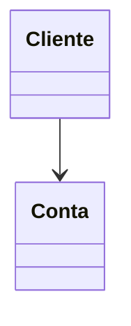

# Estudo de Associações na Orientação à Objetos

## Simples
* Quando duas ou mais classes se relacionam mas não há dependencia entre elas para
existirem;

ex:
 
* As classes Cliente e Conta do pacote "simples" deste estudo;
* No diagrama de classe essa relação é representada por uma linha simples:

## Agragação

## Composição 