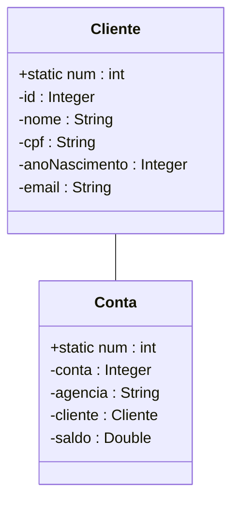

# Estudo de Relacionamentos entre as classes na Orientação à Objetos

## Associação Simples
* Quando duas classes se relacionam (se utilizam, uma dentro da outra ou como parâmetro)
mas não há dependencia entre elas para existirem;
* No diagrama de classe essa relação é representada por uma linha simples;

ex:
 

## Agragação

## Composição 