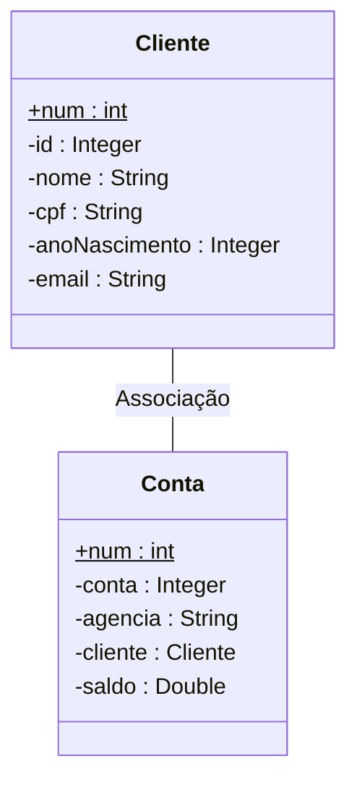
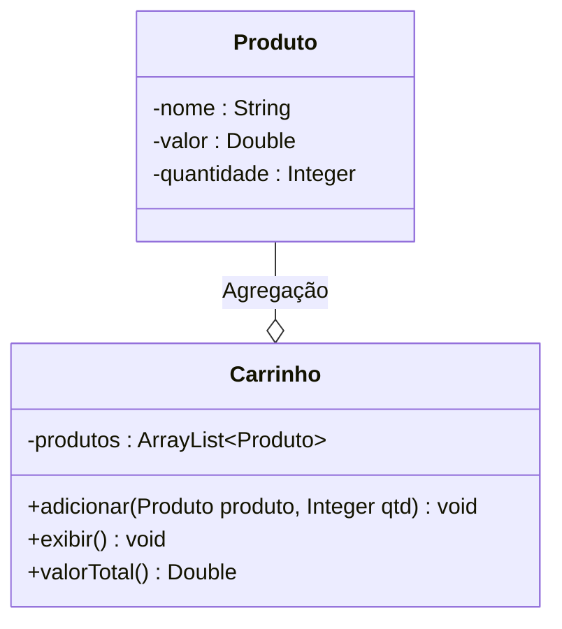
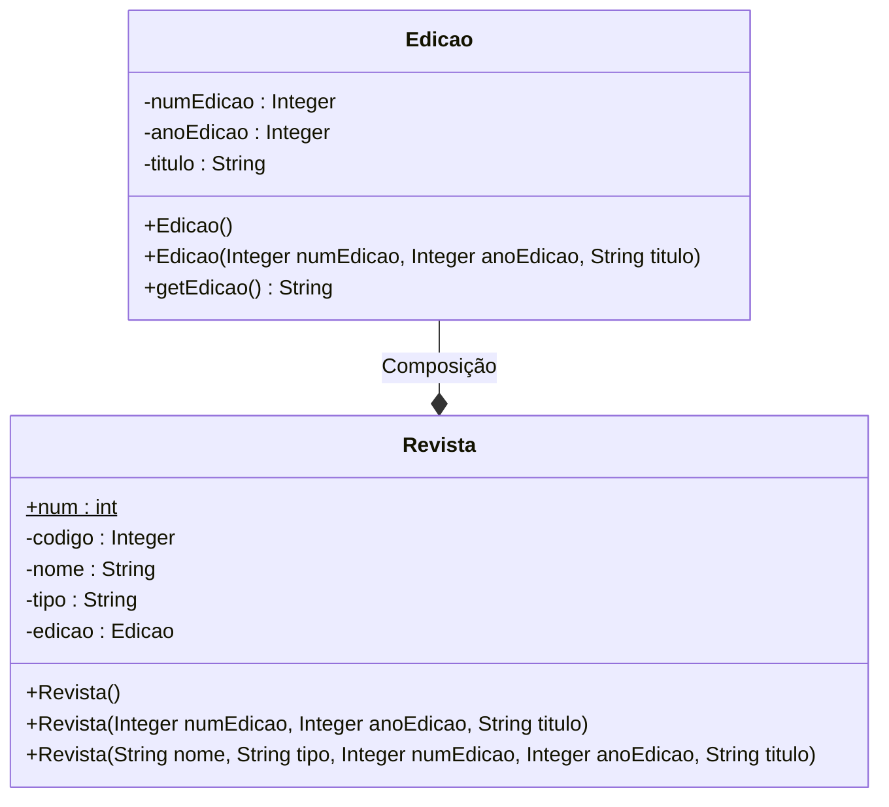

# Estudo de Relacionamentos entre as classes na Orientação à Objetos

### Associação Simples
* Quando duas classes se relacionam (se utilizam, uma dentro da outra ou como parâmetro)
mas não há dependencia entre elas para existirem;
* No diagrama de classe essa relação é representada por uma linha simples;

#### Ex:
 

### Agregação
* Relacionamento "Parte-Todo", onde a classe "Parte" não depende do "Todo" para existir;
* Ela é representada por uma linha com um losango vazio na ponta, partindo da classe
"parte" conectando com o "todo";

#### Ex:
 

### Composição
* Assim como na agragação há um relacionamento "Parte-Todo", sendo que a "parte"
não exite sem o "todo";
* A classe "todo" cria uma instância da classe "parte" dentro de si, sofrendo assim,
a consequência de exclusão quando a classe "todo" for excluída;
* Sua representação se dá no simbolo do traço com um losando preechido na sua extremidade,
partindo da classe "parte" para o "todo";

#### Ex:
 

 

